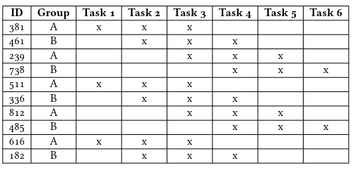

#  Study

This folder contains all necessary documents and files to replicate the study. The following sections will explain further details.

## Structure

The study submodule is structured into the following files and folder:

- **Group A**: Contains the documents used for group A
    - explanation.pdf: PDF explaining the study to the participant
    - privacy.pdf: Privacy declaration to be filled out by the participant
    - protocol: Protocol to be filled out by the supervisor
    - survey: Contains the questionnaire that should be filled out by the participants
- **Group B**: Contains the documents used for group B
    - explanation.pdf: PDF explaining the study to the participant
    - privacy.pdf: Privacy declaration to be filled out by the participant
    - protocol: Protocol to be filled out by the supervisor
    - survey: Contains the questionnaire that should be filled out by the participants
- **Code**: Contains the unedited code grouped by tasks. See the section *Replication* for further details.
- **measurements_evaluation.ods**: Raw .ods file used to save the calculated results from the program evaluation
- **questionnaire_evaluation.ods**: Raw .ods file used to save the evaluated questionnaires collected during the study

## Replication

Please make sure [VSCode](https://code.visualstudio.com/), [kCachegrind](https://kcachegrind.github.io/html/Home.html), [SPEAR](https://github.com/printerboi/spear) and the [SPEAR-Viewer](https://github.com/printerboi/spear-viewer) are installed. See the installation instruction for the respective application.

If you want to replicate the study, please keep to the following procedure:

1) Distribute the tasks from the `Code` folder among the 10 participants following this table:

    

    The provided code contains all the necessary files to perform the study on the respective task without further modification. This includes:
     - The prepared `spear.yml` with the configuration of the corresponding task
     - The `.spear` folder containing the profile of the original system 
     - The build script

2) Conduct the study with each participant separately

3) Take the set of study documents of the group the participant belongs to
    1) Before the study begins, participants need to sign the privacy declaration

    2) Collect the privacy declaration and give the participants the `explanation.pdf`

    3) Open the work environment and show the participant how to interact with the device.

    4) Start the screen recording

    5) Let participants edit their tasks. The editing phase is separated into three time slots. Each time slot is 15 minutes long. After the time has run out. Participants were told to save their work and make sure that it is compilable. If the program was not compilable, participants were given up to 5 minutes, to clean up the program. After the time slot, participants were instructed to switch to the next task. A preliminary switch of the task was allowed.

    6) After the all tasks have been edited: Stop the recording and give the participant the corresponding questionnaire.

    7) Collect all filled out documents and the edited programs and save them.

4) For each participant:

    1) Execute the `result.py`script on the folder containing the edited tasks of the user (See Module [Scripts](../Scripts/README.md) for a more detailed explanation)

    2) Save the created `result.csv` and execute the `parser.py` script on the `result.csv` file. Save the generated pyplot image. (See Module [Scripts](../Scripts/README.md) for a more detailed explanation)

    3) Save the console output generated by the `parser.py` script to the `measurements_evaluation.ods` file for the corresponding participant

    4) Evaluate the collected questionnaire of each participant and save it to the `questionnaire_evaluations.ods` file
